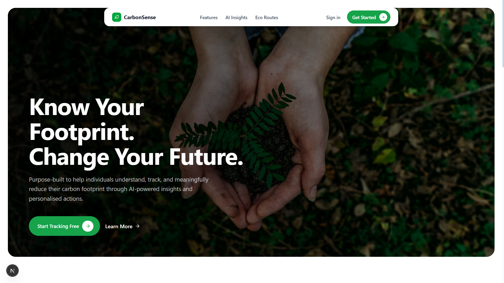
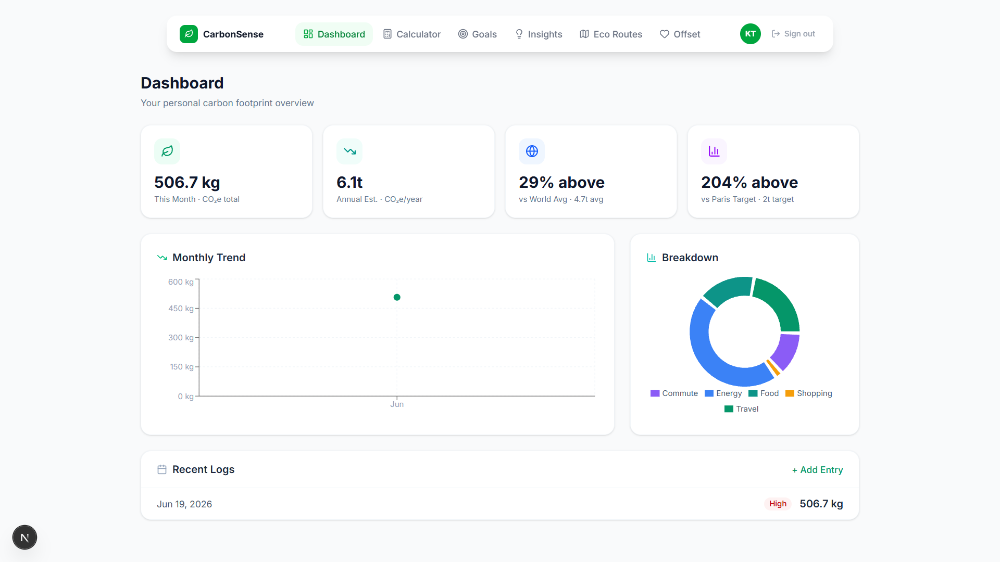
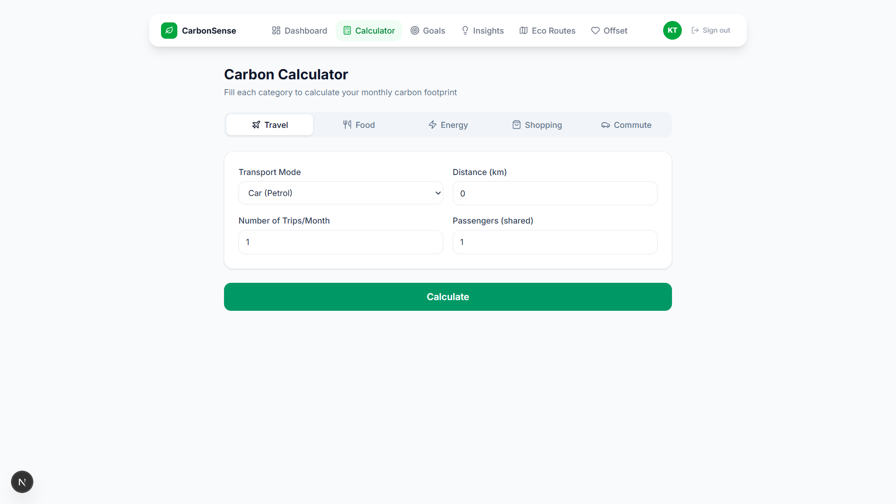
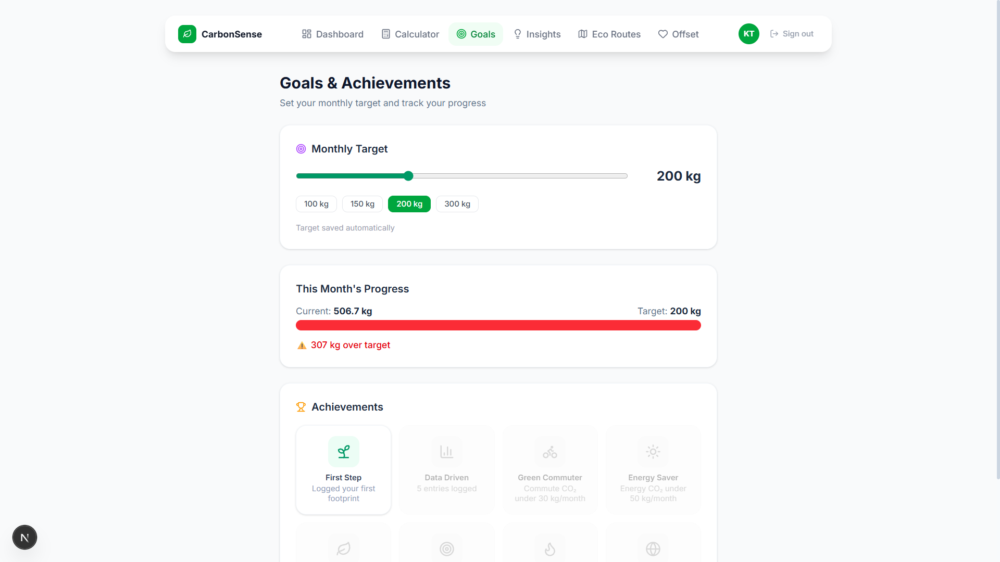
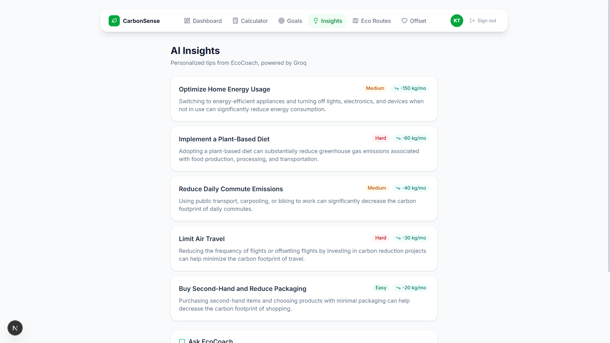
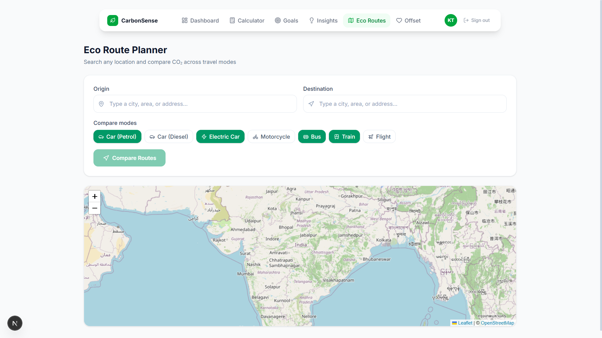
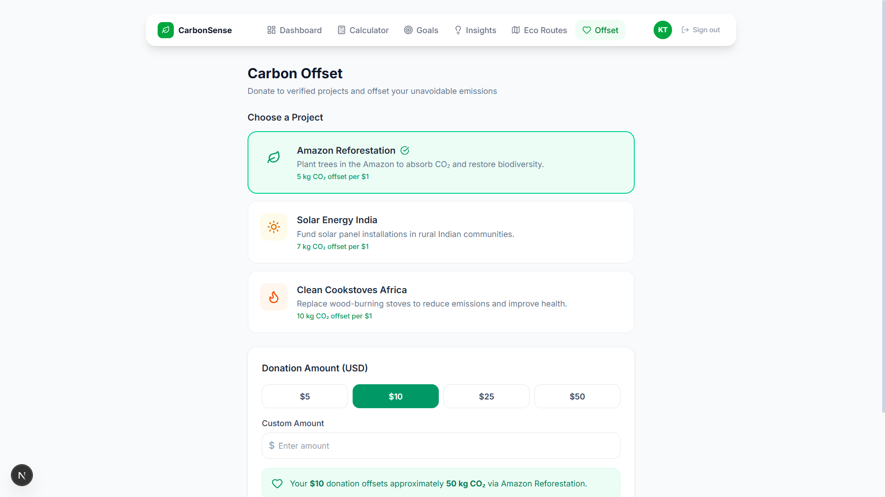

# 🌿 CarbonSense

> **Personal Carbon Footprint Awareness Platform** — Track, understand, and reduce your carbon emissions with AI-powered insights.

---

## User Interface

- Landing Page
 
  
  
- Dashboard

  

- Calculator

  

- Goals

  

- Insights

  

- Travel

  

- Offset

  

---

## ✨ Features

| Feature | Description |
|---|---|
| 🧮 **Carbon Calculator** | Multi-domain footprint tracking across Travel, Food, Energy, Shopping & Commute |
| 📊 **Dashboard** | Monthly trend charts, category breakdown, and comparison vs global averages |
| 🎯 **Goals & Badges** | Set monthly reduction targets and unlock achievement badges |
| 🤖 **AI Insights** | Groq-powered (Llama 3.3 70B) personalized reduction tips + EcoCoach chat |
| 🗺️ **Eco Route Planner** | Compare CO₂ across Car, EV, Bus, Train, Flight — with live map routing |
| 💚 **Carbon Offset** | Donate to verified offset projects via Stripe Checkout |
| 🔐 **Authentication** | Email/password auth with Supabase + protected routes |

---

## 🛠️ Tech Stack

- **Framework** — Next.js 16 (App Router, Turbopack)
- **Styling** — Tailwind CSS v4 + Lucide React icons
- **Auth & Database** — Supabase (PostgreSQL + Row Level Security)
- **AI** — Groq Cloud API (Llama 3.3 70B Versatile)
- **Maps** — Leaflet.js + OpenRouteService API + Nominatim geocoding
- **Payments** — Stripe Checkout
- **Charts** — Recharts
- **Deployment** — Vercel

---

## 📁 Project Structure

```
carbonsense/
├── src/
│   ├── app/
│   │   ├── (dashboard)/        # Protected dashboard pages
│   │   │   ├── dashboard/      # Overview charts & stats
│   │   │   ├── calculator/     # 5-tab CO₂ calculator
│   │   │   ├── goals/          # Targets & achievement badges
│   │   │   ├── insights/       # AI tips & EcoCoach chat
│   │   │   ├── travel/         # Eco route planner + map
│   │   │   └── offset/         # Stripe carbon offset donations
│   │   ├── api/
│   │   │   ├── calculator/     # CO₂ calculation + save
│   │   │   ├── history/        # Fetch/save footprint entries
│   │   │   ├── health/         # GET & HEAD health check (UptimeRobot)
│   │   │   ├── insights/       # Groq AI tips generation
│   │   │   └── stripe/         # Stripe checkout session
│   │   ├── auth/callback/      # OAuth redirect handler
│   │   ├── login/              # Sign in page
│   │   └── register/           # Sign up page
│   ├── lib/
│   │   ├── supabase/           # Browser & server clients
│   │   ├── groq.ts             # Groq SDK client
│   │   ├── stripe.ts           # Stripe SDK client
│   │   ├── calculateCO2.ts     # Core emission calculation logic
│   │   └── emissionFactors.ts  # IPCC AR6 / EPA emission constants
│   ├── types/index.ts          # Shared TypeScript interfaces
│   └── proxy.ts                # Auth middleware (Next.js 16)
├── supabase_schema.sql          # Database schema — run in Supabase SQL Editor
└── .env.local                   # Environment variables (see setup below)
```

---

## 🚀 Getting Started

### 1. Clone & Install

```bash
git clone https://github.com/your-username/carbonsense.git
cd carbonsense
npm install
```

### 2. Set Up Environment Variables

Create `.env.local` in the project root:

```env
# Supabase
NEXT_PUBLIC_SUPABASE_URL=your_supabase_project_url
NEXT_PUBLIC_SUPABASE_ANON_KEY=your_supabase_anon_key
SUPABASE_SERVICE_ROLE_KEY=your_service_role_key

# Groq AI
GROQ_API_KEY=your_groq_api_key

# Stripe
NEXT_PUBLIC_STRIPE_PUBLISHABLE_KEY=your_stripe_publishable_key
STRIPE_SECRET_KEY=your_stripe_secret_key

# OpenRouteService (optional — enables live route polylines)
NEXT_PUBLIC_ORS_API_KEY=your_ors_api_key

# App
NEXT_PUBLIC_APP_URL=http://localhost:3000
```

### 3. Set Up Supabase Database

1. Go to your [Supabase Dashboard](https://supabase.com/dashboard)
2. Open **SQL Editor → New Query**
3. Paste and run the contents of `supabase_schema.sql`

This creates:
- `profiles` — user info (auto-populated on signup via trigger)
- `footprint_entries` — CO₂ logs with computed `total_kg`
- `goals` — monthly reduction targets
- `user_badges` — unlocked achievements
- `carbon_offsets` — Stripe payment records
- Row Level Security policies for all tables

### 4. Run Locally

```bash
npm run dev
```

Open [http://localhost:3000](http://localhost:3000)

---

## 🌍 Emission Factors

CO₂ calculations use industry-standard factors from **IPCC AR6** and **EPA 2023**:

| Category | Source | Example |
|---|---|---|
| Transport | IPCC AR6 WGIII | Car petrol: 0.192 kg/km |
| Food | FAO / Oxford LEAP | Paneer: 1.7 kg CO₂/serving |
| Energy | IEA 2023 grid mix | India grid: 0.82 kg/kWh |
| Shopping | Carbon Trust | Smartphone: 70 kg/unit |

---

## 🧪 Stripe Test Cards

Since the app uses Stripe test mode:

| Card | Number |
|---|---|
| ✅ Success | `4242 4242 4242 4242` |
| ❌ Declined | `4000 0000 0000 0002` |

Use any future expiry, any 3-digit CVC.

---

## 🗺️ Eco Route Planner

The route planner uses:
- **Nominatim** (OpenStreetMap) — free location autocomplete, no API key needed
- **OpenRouteService** — live road routing and polyline drawing (optional free API key)
- **Leaflet.js** — interactive map

Without an ORS key, distances are estimated using straight-line (Haversine) calculation.
Get a free ORS key at [openrouteservice.org](https://openrouteservice.org/dev/#/home)

---

## ☁️ Deploy to Vercel

```bash
npx vercel
```

Add all `.env.local` variables in **Vercel → Project Settings → Environment Variables**.

Update `NEXT_PUBLIC_APP_URL` to your production domain.

The included `vercel.json` sets the deployment region to **Mumbai (bom1)** and adds security headers automatically.

---

## 🩺 Monitoring

A health endpoint is available for uptime monitoring:

```
GET  /api/health  →  { status: "ok", db: "ok", timestamp: "...", service: "carbonsense" }
HEAD /api/health  →  200 (no body)
```

Every `GET` request also runs a lightweight Supabase query, which **prevents the free-tier project from pausing** due to inactivity (Supabase pauses after 7 days of no DB activity).

**UptimeRobot setup:**
1. Add new monitor → Type: **HTTP(s)**
2. URL: `https://your-domain.vercel.app/api/health`
3. Monitoring interval: **5 minutes**

One monitor keeps both Vercel and Supabase alive. ✅

---

## 📄 License

MIT License - See [LICENSE](./LICENSE.md) file for details
